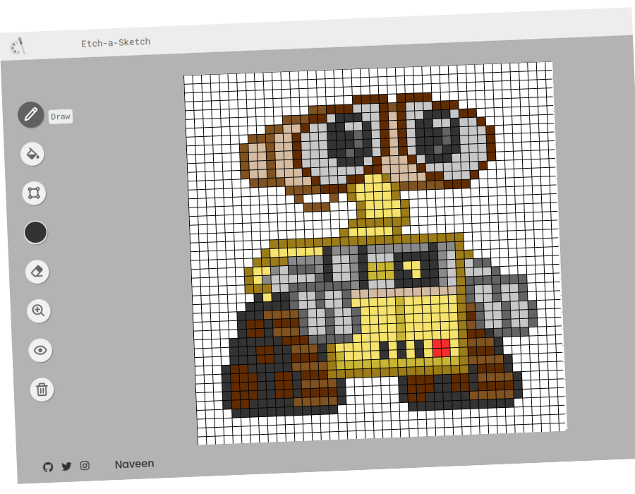

# Neat 🎨
A browser version of something between a sketchpad and an Etch-A-Sketch.

[Checkout the demo](https://peaceful-panda.netlify.app/)

# Features

- 🍥 **UI Design** - simple & minimalist design inspired by Autodraw
- 🖍️ **[Draw](#draw)** - draw any thing you want with pixels
- 🥛 **[Fill](#fill)** - change the background color as you want
- 🎨 **Color** - a whole world of color at your disposal, change the color of the pencil, the background
- ✏️ **Eraser** - erase the slightest error to the pixel, literally as if it never existed
- 🔍 **Zoom** - bigger? thinner? The choice is yours depending on the design you have in mind
- 👌 **[Grid-view](#view)** - display the grid
- 🗑️ **Trash** - erase everything to start over

This project is about creating a pretty neat (hence the name) toy to flex my DOM manipulation skills. Neat is a browser version of something between a sketchpad and an Etch-A-Sketch.
Hope you enjoy it!!

# Next features to add
- [ ]  ⬜ **[Shading](#shades)** - Shading and lighten functionnality
- [ ]  📱 **[Responsive](#mobile)** - mobile friendly, works with any screen size and devices
- [ ]  🔗 **[Share](#socials)** - share your creation with your friends on social network
- [ ]  📥 **[Download](#jpg)** - save your creation as a png, jpg image

# Author

Neat is developed by [@Naveen](https://github.com/claymeers)